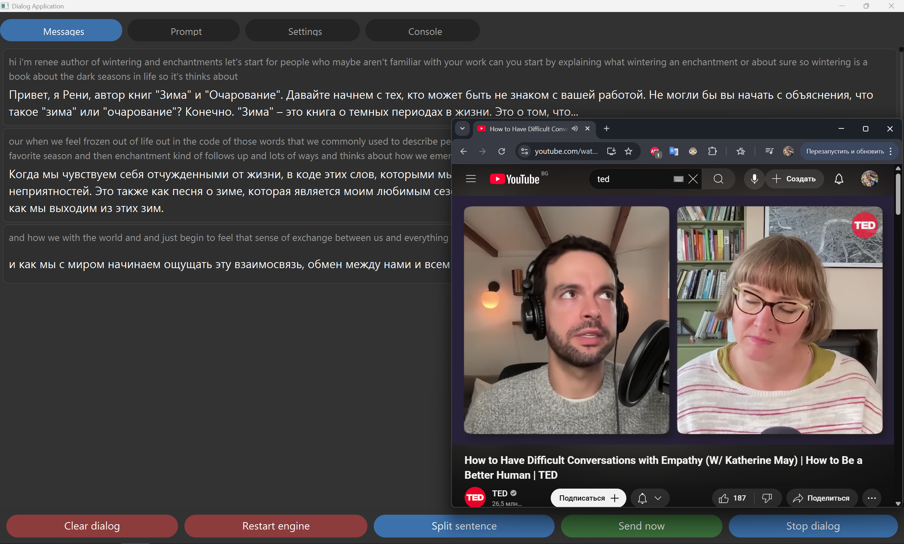
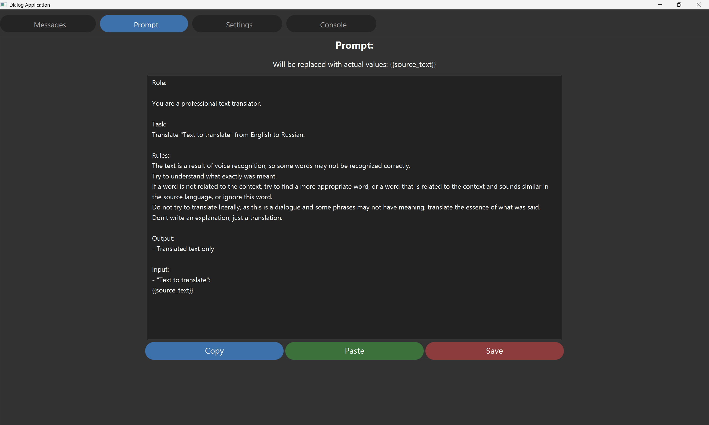
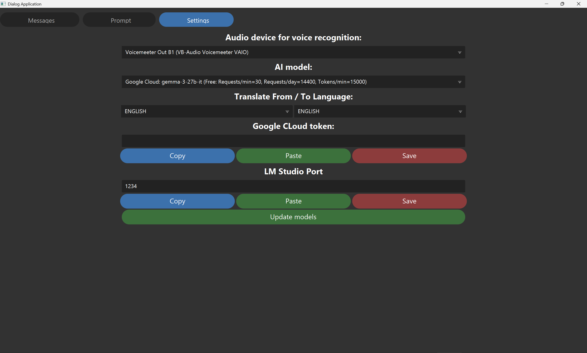

# Dialog AI Helper - PC Version

## What is this app for?

You can use this app to translate dialogue or to generate suggestions during a dialogue in real time.

The application's operation consists of 2 stages:

* **Voice recognition**: Recognize each sentence in a dialogue in a continuous mode

* **Sending to LLM**: Send the recognized text with prompt to LLM models and receive responses in a continuous mode

## Voice recognition

The [Vosk engine](https://alphacephei.com/vosk/) is used for voice recognition - of the ones I tested, this is the best engine.

For it to work, you must download the model for your language from [Vosk models](https://alphacephei.com/vosk/models) and unzip it to a folder, then select the folder with the Vosk model in the app.

Of the models I tested, the big 1.8 GB models like [vosk-model-en-us-0.22](https://alphacephei.com/vosk/models/vosk-model-en-us-0.22.zip) work best - they are more stable than the smaller 128 MB models like [vosk-model-en-us-0.22-lgraph](https://alphacephei.com/vosk/models/vosk-model-en-us-0.22-lgraph.zip).

## Cloud LLM models

The app supports Google Gemini / Gemma AI models, for them to work you need to get a [Google Cloud API Key](https://cloud.google.com/docs/authentication/api-keys) for Gemini API and enable this API in [Google Cloud Console](https://console.cloud.google.com/apis/api/generativelanguage.googleapis.com/)

Different Google AI models models have different [free usage limits](https://ai.google.dev/gemini-api/docs/rate-limits), I used the [Gemma 3 27B](https://ai.google.dev/gemma/docs/core) model because it has a limit of 14,000 free requests per day.

If a model has reached its limits, you can switch to another model in the application settings.

## Local LLM models

The app also supports models running locally in [LM Studio](https://lmstudio.ai/) and [Ollama](https://ollama.com/)

In terms of performance, I didn't notice any difference between the Gemma 3 27B model running in Google Cloud and running in LM Studio on an RTX3070 graphics card.

If you have a weaker graphics card and experience a delay in response generation when using local models, you can download and run lighter versions with 4-8B parameters.

In the app you can specify the url they work on, click Update Model List, and the available models will be added to the general list of models.

I used the [Gemma 3](https://ai.google.dev/gemma/docs/core) and [Gemma 3n](https://ai.google.dev/gemma/docs/gemma-3n) models by Google and they have proven themselves well.

## Use for conferences

If you need dialogue translation during a conference, that is, you need to send audio from the conference to this app and to your audio device, you can create a virtual audio input and a virtual audio output and route the audio to the virtual audio output and to your audio device at the same time. I did this with [VB-Audio VoiceMeeter Banana](https://vb-audio.com/Voicemeeter/banana.htm) audio mixer application

## Additional information

Tested only on Windows.

Commands for download models via Ollama:

**ollama run gemma3:4b**

**ollama run gemma3:12b**

**ollama run gemma3:27b**

**ollama run gemma3n:e2b**

**ollama run gemma3n:e4b**

Command for run Ollama:

**ollama serve**

After that, in the application settings, you can click Update Ollama model list and all downloaded models will be added to the general list of models.

## Future features

Ability to save multiple different prompts for different purposes

Function calls via LangChain

Refine answer button - for each LLM model answer

 

 
 
 