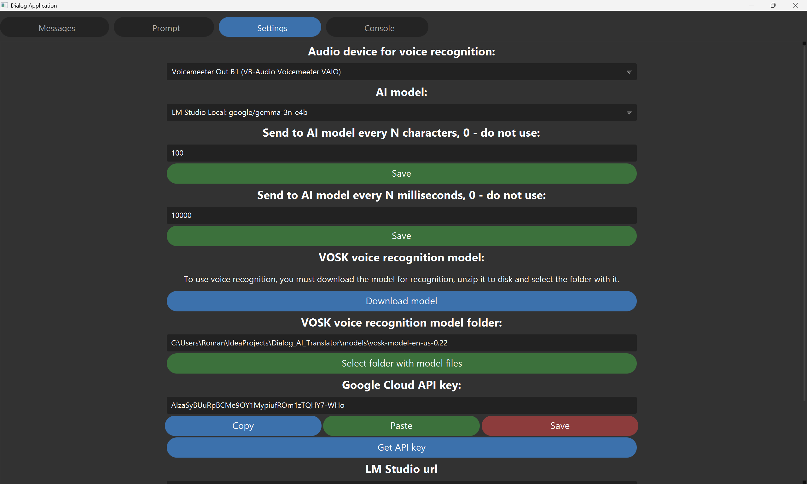

# Dialog AI Helper

This is a PC app that can

1. Recognize all dialogue lines in a continuous mode to text
2. Send the recognized text to LLM models and receive responses in a continuous mode

You can use this app to translate dialogues or provide hints during a dialogue.

The [Vosk engine](https://alphacephei.com/vosk/) is used for voice recognition - of the ones I tested, this is the best engine.

For it to work, you must download the model for your language from [Vosk models](https://alphacephei.com/vosk/models) and unzip it to a folder, then select the folder with the Vosk model in the app.

Of the models I tested, the 1.8 GB models work best - they are more stable than the smaller models.

The app supports Google AI models, for them to work you need to get a [Google Cloud API Key](https://cloud.google.com/docs/authentication/api-keys) for Gemini API and enable this API

Different models have different free usage limits, I used the Gemma 3 27B model because it has a limit of 14,000 free calls per day.

The app also supports models running locally in [LM Studio](https://lmstudio.ai/) and [Ollama](https://ollama.com/)

I used the Gemma 3 and Gemma 3n models by Google and they have proven themselves well.

If you need dialogue translation during a conference, that is, you need to send audio from the conference to this app and to your audio device, you can create a virtual audio input and a virtual audio output and route the audio to the virtual audio output and to your audio device at the same time. I did this with [VB-Audio VoiceMeeter Banana](https://vb-audio.com/Voicemeeter/banana.htm) audio mixer application

Tested only on Windows.

 

 
 
 